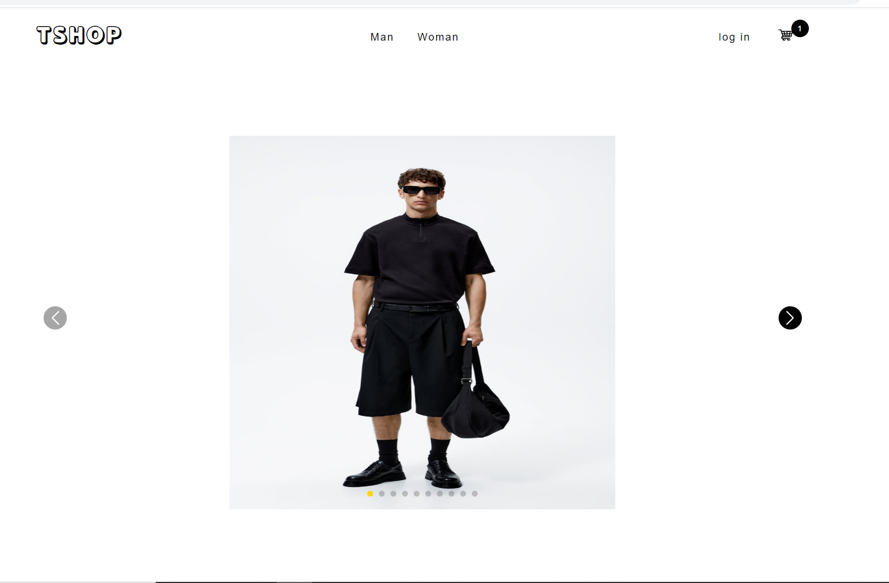
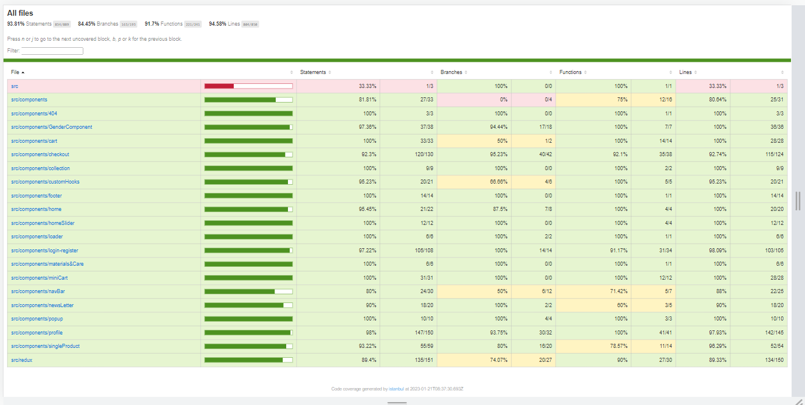

# TSHOP Ecommerce



This project is a minimal viable product built with React.
You can see it live [here](https://idrisscissoko.com/tshop/) </br>
You can see the backend code [here](https://github.com/idriss30/tshop-backend)

# Prerequisites :

To clone and run this application, you'll need [Git](https://git-scm.com) and [Node.js](https://nodejs.org/en/download/) (which comes with [npm](http://npmjs.com)) installed on your computer.

# Technology used :

- React
- Redux
- emotion/React
- axios
- gsap
- swiper
- Jest
- react testing library
- Nock
- React-router-dom

# Features

- Authentication
- State Management
- Asynchronous javascript
- fully functionnal Cart
- NewsLetter
- localStorage
- Session storage
- Payment integration
- Animation
- Error handling
- custom Hooks
- unit and integration tests
- Lazy loading images

# How to use

```bash
# Clone this repository
$ git clone https://github.com/idriss30/t-shop.git

# Go into the repository
$ cd t-shop

# Install dependencies
$ npm install

# create environment variables
$ create a .env file

# you will need two environment variables
REACT_APP_URL # url link to the running backend server, backend link is provided at the top of readme file
REACT_APP_STRIPE # stripe private key starting with pk

# Run the app
$ npm run start

# Run the test
$ npm run test

```

# Test Coverage



# Author

Created by me Idris.</br>
You can find me on [LinkedIn](www.linkedin.com/in/idrissciss)

# Support

If you learn anything from this project and/or would like to support:</br>
Please give a star, I would appreciate.</br>
Thanks for your time.
